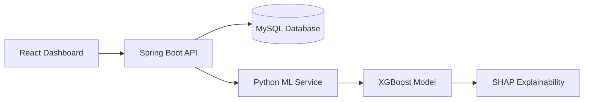

# 🛒 CartRescue AI

> An intelligent cart abandonment prediction and recovery platform that helps e-commerce businesses identify high-risk customers, understand why they leave without purchasing, and recommend the most effective recovery action.

---

## 📌 Overview

CartRescue AI is a full-stack application built to reduce shopping cart abandonment using customer behavior analytics and machine learning.

The platform analyzes customer sessions, clickstream events, cart activity, and payment history to estimate abandonment risk. Instead of treating every incomplete checkout as an abandoned cart, it identifies the customer's intent and recommends an appropriate action such as retrying payment, sending a reminder, offering free shipping, or taking no action.

The objective is to improve conversion rates while avoiding unnecessary discounts.

---

# 🚀 Features

- Predicts cart abandonment risk in real time
- Customer intent classification
- Explainable AI using SHAP
- Personalized recovery recommendations
- Analytics dashboard
- Session monitoring
- Revenue recovery insights
- REST API integration
- Docker support

---

# 💡 Customer Intent Classification

Rather than classifying every incomplete purchase as abandonment, CartRescue AI identifies customer intent.

Current intent categories include:

- Buy Now
- Buy Later
- Price Sensitive
- Payment Issue
- Delivery Concern
- Window Shopper
- High Abandonment Risk

This helps businesses respond more accurately and avoid unnecessary promotional costs.

---

# 🏗 System Architecture



---

# ⚙️ Tech Stack

| Layer | Technology |
|--------|------------|
| Frontend | React, Vite, Tailwind CSS, Material UI |
| Backend | Spring Boot, Spring Security, JPA, Hibernate |
| Machine Learning | Python, FastAPI, XGBoost, SHAP |
| Database | MySQL |
| Charts | Chart.js |
| Authentication | JWT |
| Deployment | Docker, Docker Compose |

---

# 📂 Dataset

The application uses customer activity collected from the following datasets:

- customers.csv
- sessions.csv
- events.csv
- orders.csv
- order_items.csv
- products.csv
- reviews.csv

These datasets are used to generate behavioral features such as session duration, cart value, checkout attempts, payment failures, customer purchase history, and revisit patterns.

---

# 🧠 Machine Learning Pipeline

The prediction pipeline consists of the following stages:

1. Data Cleaning
2. Feature Engineering
3. Model Training (XGBoost)
4. Prediction
5. SHAP Explainability
6. Customer Intent Classification
7. Recommendation Generation

The prediction service is exposed through a FastAPI REST endpoint and integrated with the Spring Boot backend.

---

# 📁 Project Structure

```
cart-rescue-ai/

├── backend/
├── frontend/
├── ml-service/
├── database/
├── docker/
├── docs/
├── screenshots/
├── README.md
└── docker-compose.yml
```

---

# 📊 Dashboard

The dashboard provides:

- Active Sessions
- High-Risk Customers
- Revenue Recovery
- Recovery Rate
- Customer Intent Distribution
- Abandonment Reasons
- Prediction History

---

# 🔗 API Endpoints

| Method | Endpoint | Description |
|---------|----------|-------------|
| POST | /api/v1/auth/login | User Login |
| POST | /api/v1/predict | Predict abandonment |
| POST | /api/v1/recommend | Get recommendation |
| GET | /api/v1/dashboard | Dashboard metrics |
| GET | /api/v1/analytics | Analytics summary |

---

# 🚀 Getting Started

## Clone Repository

```bash
git clone https://github.com/your-username/cart-rescue-ai.git

cd cart-rescue-ai
```

---

## Run using Docker

```bash
docker-compose up --build
```

Available Services

| Service | URL |
|----------|-----|
| Frontend | http://localhost |
| Backend | http://localhost:8080 |
| Swagger | http://localhost:8080/swagger-ui/index.html |
| ML Service | http://localhost:8000/docs |

---

## Run Locally

### Backend

```bash
cd backend

mvn clean install

mvn spring-boot:run
```

### ML Service

```bash
cd ml-service

pip install -r requirements.txt

python train_model.py

python main.py
```

### Frontend

```bash
cd frontend

npm install

npm run dev
```

---

# 📸 Screenshots

Dashboard

(Add Screenshot)

Prediction Screen

(Add Screenshot)

Analytics

(Add Screenshot)

Recommendation Panel

(Add Screenshot)

---

# 📈 Model Evaluation

The model is evaluated using:

- Accuracy
- Precision
- Recall
- F1 Score
- ROC-AUC

Evaluation results will be updated after training on the final dataset.

---

# 🔮 Future Improvements

- Real-time event streaming
- Personalized coupon generation
- Reinforcement learning for offer optimization
- Multi-language support
- Cloud deployment
- Mobile notifications

---

# 👥 Team

| Member | Responsibility |
|----------|---------------|
| Member 1 | Backend Development |
| Member 2 | Frontend Development |
| Member 3 | Machine Learning |
| Member 4 | Documentation & Presentation |

---

# 📄 License

This project is licensed under the MIT License.