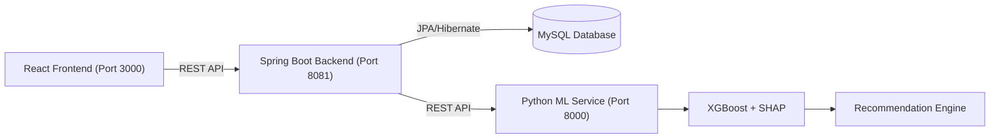

# 🛒 CartRescue AI

### Intelligent Cart Abandonment Prediction & Recovery Platform

> An AI-powered platform that predicts shopping cart abandonment, identifies customer intent, and recommends personalized recovery actions to improve conversion rates and reduce revenue loss.

---

# Project Overview

Shopping cart abandonment is a common challenge in e-commerce, where customers add products to their cart but leave before completing their purchase. Businesses often respond by offering discounts to every customer, which increases marketing costs and reduces profit margins without understanding the real reason behind the abandonment.

CartRescue AI helps solve this problem by analyzing customer sessions, clickstream events, payment behavior, and purchase history. The platform predicts the likelihood of cart abandonment, identifies the customer's intent, and provides actionable recommendations that help businesses recover potential sales while improving the overall shopping experience.

---

# Our Solution

CartRescue AI combines machine learning, behavioral analytics, and a modern analytics dashboard into a single platform.

The solution:

- Predicts cart abandonment risk using an XGBoost machine learning model.
- Explains every prediction using SHAP Explainable AI.
- Identifies customer intent based on browsing and checkout behavior.
- Recommends a single personalized recovery action such as payment retry, reminder notification, free shipping, or a targeted discount.
- Provides a real-time dashboard for monitoring customer activity, predictions, and recovery performance.

Instead of applying the same recovery strategy to every customer, CartRescue AI helps businesses make data-driven decisions by selecting the most appropriate action for each individual shopper.

---

# Key Highlights

- **XGBoost Risk Prediction** for real-time cart abandonment analysis.
- **SHAP Explainable AI** to provide transparent prediction insights.
- **Live Session Monitoring** with continuous customer activity tracking.
- **Customer Intent Classification** based on shopping behavior.
- **Smart Recommendation Engine** for personalized recovery actions.
- **Interactive Analytics Dashboard** with real-time business insights.
- **WhatsApp, Email, and SMS Recovery Support** for customer engagement.
- **Modern Responsive Interface** built with React and Material UI.

---

# System Architecture



---

# Technology Stack

| Layer | Technology |
|-------|------------|
| Frontend | React, Vite, Tailwind CSS, Material UI, Chart.js |
| Backend | Java 21, Spring Boot, Spring Security, Spring Data JPA |
| Machine Learning | Python, FastAPI, XGBoost, SHAP, Scikit-learn |
| Database | MySQL |
| Authentication | JWT |
| Deployment | Docker, Docker Compose |

---

# Customer Intent Categories

| Intent | Recommended Action |
|---------|--------------------|
| Payment Issue | Retry Payment |
| Price Sensitive | Offer Discount |
| Delivery Concern | Free Shipping |
| Buy Later | Reminder Notification |
| Window Shopper | Exit Intent Prompt |

---

# Quick Start

## Clone Repository

```bash
git clone https://github.com/SHAIKZILANI/AI_HACKATHON.git

cd AI_HACKATHON
```

## Backend

```bash
cd backend

mvn spring-boot:run
```

## Machine Learning Service

```bash
cd ml-service

pip install -r requirements.txt

python main.py
```

## Frontend

```bash
cd frontend

npm install

npm run dev
```

---

# Application URLs

| Service | URL |
|---------|-----|
| Frontend Dashboard | http://localhost:3000/dashboard |
| Executive Dashboard | http://localhost:3000/dashboard |
| Live Risk Stream | http://localhost:3000/predictions |
| Deep Analytics | http://localhost:3000/analytics |
| AI Copywriter | http://localhost:3000/ai-copywriter |
| Storefront Simulator | http://localhost:3000/storefront |
| Policy Rules | http://localhost:3000/policy-rules |
| Backend API | http://localhost:8081/api/v1 |
| Swagger Documentation | http://localhost:8081/swagger-ui/index.html |
| ML API Documentation | http://localhost:8000/docs |

---

# Future Enhancements

- Real-time event streaming
- Dynamic coupon optimization
- Multi-language support
- Cloud deployment
- Mobile application
- Predictive customer segmentation

---

# License

This project is licensed under the MIT License. See the `LICENSE` file for more information.