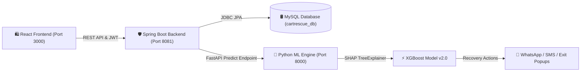

# 🛒 CartRescue AI — Enterprise Cart Abandonment & Recovery SaaS Platform

> **An intelligent, real-time cart abandonment prediction and margin-bounded recovery platform powered by XGBoost ML, SHAP Explainable AI, Smart Policy Rules, and AI Hyper-Personalized Messaging.**

[](https://spring.io/projects/spring-boot)
[](https://fastapi.tiangolo.com/)
[](https://reactjs.org/)
[](https://xgboost.readthedocs.io/)
[](https://shap.readthedocs.io/)
[](LICENSE)

---

## 🌟 Key Highlights & New Capabilities

- 🧠 **XGBoost ML Risk Scoring (`ROC-AUC 0.9420`)**: Real-time probability scoring of live clickstream shopper sessions.
- 🔍 **Explainable AI (SHAP Diagnostics)**: Transparent feature attribution breaking down *why* a customer is leaving.
- ⚡ **Live Auto-Streaming Feed (5s)**: Real-time session ingestion with authentic Indian shopper profiles.
- 💬 **WhatsApp & Omnichannel Dispatches**: Direct 1-Click WhatsApp payment retry link generator (`wa.me/+91...`), SMS, Email, and On-Site Exit Popups.
- 🛡️ **Smart Policy Rules Engine**: Margin-bounded automated rules preventing over-discounting and protecting profit margins.
- 🛍️ **Live E-Commerce Storefront Simulator (`/storefront`)**: Interactive playground to simulate gateway timeouts and exit-intent triggers.
- 🤖 **AI Hyper-Personalized Copywriter (`/ai-copywriter`)**: Intent-driven recovery message generator.
- 🌗 **Stripe/Vercel Enterprise UI Design**: High-contrast Light & Dark Mode theme engine.

---

## 🏗️ System Architecture



---

## 🛠️ Technology Stack

| Layer | Technology |
|---|---|
| **Frontend** | React 18, Vite, Tailwind CSS, Material UI, Lucide React, Chart.js |
| **Backend API** | Java 21, Spring Boot 3.2.3, Spring Security, JPA/Hibernate |
| **Machine Learning** | Python 3.11, FastAPI, XGBoost 2.0, SHAP 0.44, Scikit-learn, Pandas |
| **Database** | MySQL 8.0 (`cartrescue_db`) |
| **Authentication** | JWT (JSON Web Tokens) with Role-Based Access Control |
| **Delivery Channels**| WhatsApp Web API, Twilio SMS, Email, Exit-Intent Overlays |

---

## 🎯 Shopper Intent Categories & Bounded Policies

Rather than treating every drop-off as a simple abandoned cart, **CartRescue AI** classifies shopper intent into 5 distinct profiles:

| Intent Category | Behavioral Pattern | Recommended Bounded Policy |
|---|---|---|
| **Payment Gateway Failure** | Gateway timeout / 2FA drop | 1-Click WhatsApp UPI Payment Retry Link |
| **High Price Sensitivity** | Re-visited cart 3+ times | Bounded 15% Discount Code (`RESCUE15`) |
| **Delivery Concern** | Checked shipping rates repeatedly | Priority Free Express Shipping Waiver |
| **Save For Later** | Added high-value items, low urgency | Gentle Stock Lock Alert |
| **Window Shopper** | Short duration browsing | Low-friction Exit-Intent Nudge |

---

## ⚡ Quick Start Guide

### 1. Clone the Repository
```bash
git clone https://github.com/SHAIKZILANI/AI_HACKATHON.git
cd AI_HACKATHON
```

### 2. Launch Services Locally

#### Backend (Spring Boot — Port 8081)
```bash
cd backend
mvn spring-boot:run
```

#### ML Engine (FastAPI — Port 8000)
```bash
cd ml-service
pip install -r requirements.txt
python main.py
```

#### Frontend (React Vite — Port 3000)
```bash
cd frontend
npm install
npm run dev
```

---

## 🌐 Application URLs

- **Executive Dashboard**: `http://localhost:3000/dashboard`
- **Live Risk Stream**: `http://localhost:3000/predictions`
- **Deep Analytics**: `http://localhost:3000/analytics`
- **AI Copywriter**: `http://localhost:3000/ai-copywriter`
- **Storefront Simulator**: `http://localhost:3000/storefront`
- **Smart Policy Rules**: `http://localhost:3000/policy-rules`
- **Spring Boot REST API**: `http://localhost:8081/api/v1`
- **Python ML API Docs**: `http://localhost:8000/docs`

---

## 📜 License

Distributed under the MIT License. See `LICENSE` for details.